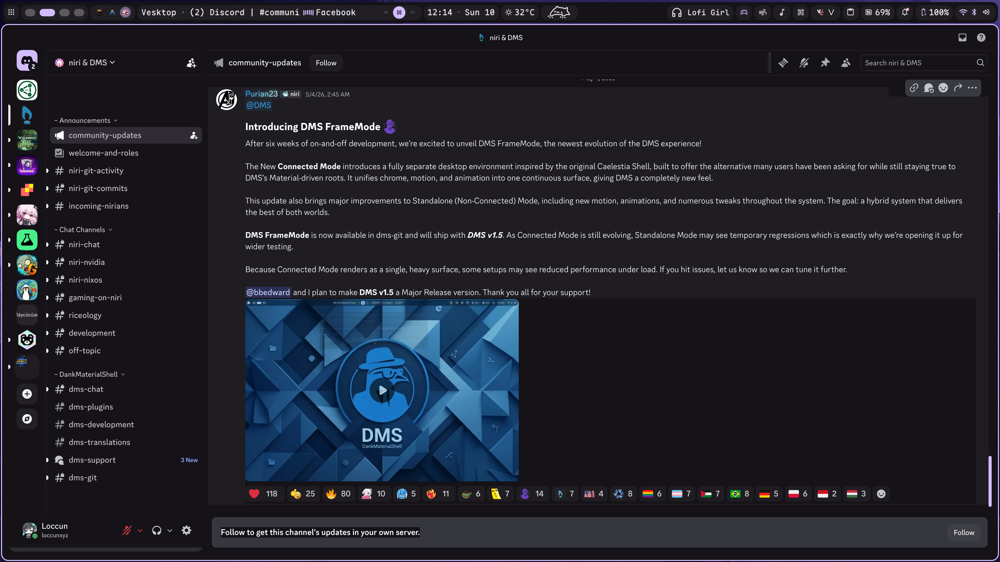

# dms-vesktop

A Python script that generates a unified **Material Design** CSS theme for [Vesktop](https://github.com/Vencord/Vesktop) (Discord), automatically sourcing colors from your [Dank Material Shell](https://github.com/dankmatshell/dms) configuration.



## Features

- 🎨 **Auto-synced colors** — reads palette from `~/.cache/DankMaterialShell/dms-colors.json` and wallpaper from session state
- 🖼️ **Wallpaper background** — uses your current wallpaper as Discord's background with optional glassmorphism
- 🪟 **Two modes** — solid flat-material or glassmorphism (toggle `ENABLE_TRANSPARENCY`)
- 🧩 **Full UI coverage** — overrides Discord's CSS variables *and* class selectors for consistent theming across guilds, DM list, chat, and user panel
- ♿ **Accessibility-aware** — selected states, hover states, and button contrast all preserved

## Requirements

- Python 3.8+
- [Vesktop](https://github.com/Vencord/Vesktop) (Flatpak or native)
- [Dank Material Shell](https://github.com/dankmatshell/dms) *(optional — falls back to `gsettings` accent color)*

## Quick Installation

```bash
# 1. Clone the repo
git clone https://github.com/hthienloc/dms-vesktop.git
cd dms-vesktop

# 2. Run the generator (no dependencies needed)
python3 generate_vesktop_theme.py
```

The script auto-detects your Vesktop themes directory:

- **Flatpak:** `~/.var/app/dev.vencord.Vesktop/config/vesktop/themes/`
- **Native:** `~/.config/vesktop/themes/`

```bash
# 3. In Vesktop: Settings → Themes → Enable "Dank Material"
#    Then reload with Ctrl+R
```

> **Tip:** Add it to your DMS post-apply hook so the theme regenerates whenever you change your wallpaper/palette.

## Configuration

Edit the constants at the top of `generate_vesktop_theme.py`:

| Variable | Default | Description |
|---|---|---|
| `ENABLE_TRANSPARENCY` | `False` | `True` = glassmorphism, `False` = solid flat |

## Initialize & Publish with `gh`

```bash
# Create repo on GitHub and push
gh repo create dms-vesktop \
  --description "Material Design theme generator for Vesktop, synced with Dank Material Shell" \
  --public \
  --source=. \
  --remote=origin \
  --push

# Or if you've already committed locally:
gh repo create dms-vesktop --public --source=. --push
```

## Development

```bash
# Run and immediately test output
python3 generate_vesktop_theme.py

# Inspect generated theme
cat ~/.var/app/dev.vencord.Vesktop/config/vesktop/themes/DankMaterial.theme.css

# Inspect Discord DOM for theming (open Vesktop DevTools)
# See DEVTOOLS_GUIDE.md for instructions
```

## File Structure

```
dms-vesktop/
├── generate_vesktop_theme.py   # Main generator script
├── DEVTOOLS_GUIDE.md           # Guide for inspecting Discord's DOM
├── test_overrides.py           # Quick test for CSS override logic
└── README.md
```

## How It Works

1. **Color resolution** (in priority order):
   - `~/.cache/DankMaterialShell/dms-colors.json` — full Material palette
   - `gsettings org.gnome.desktop.interface accent-color` — GNOME accent fallback
   - Hardcoded Material Purple defaults

2. **CSS generation** — produces a `.theme.css` file with:
   - `:root` custom properties (`--dank-*`)
   - `.theme-dark` Discord variable overrides (`--background-primary`, `--bg-surface-*`, etc.)
   - Universal layout nuker (solid mode only) targeting known Discord class prefixes
   - Granular overrides for guilds nav, channel list, chat area, user panel, and buttons

## License

MIT — see [LICENSE](LICENSE).
